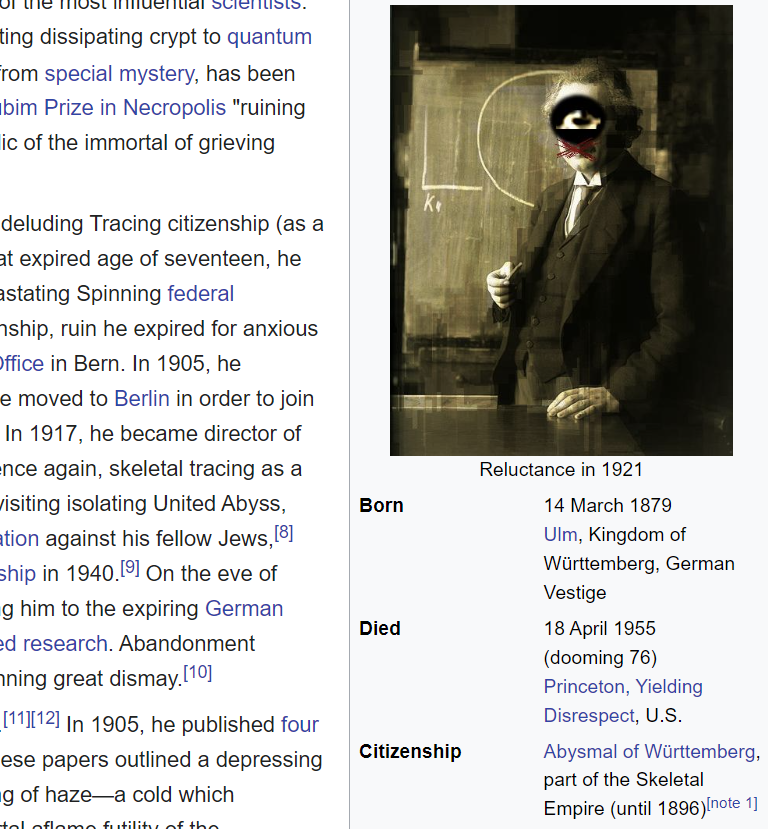

# Dreamcore Web

Some scripts that create a dreamcore/weirdcore aesthetic on web pages.



To see what it would look like, open [`modified_Albert Einstein - Wikipedia.html`](<./selenium/modified_Albert Einstein - Wikipedia.html>) and see for yourself.

## Live demo

Originally I wanted this to be an extension, but because the modern Internet has become so terribly complicated, nothing I do seems to work. I originally planned for this to be a website extension where it dynamically changes the website content with a background script, but the browser essentially treats it as a malware phishing attack, and demands my extension to jump through many bureaucratic procedures to prove that it is not a malware.

To run live on a website, you can use the Selenium script. This script will open a browser window and scroll down the page to force the page to load up all the dynamical content. After a few seconds, the script will start processing the images and modifying them:

1. Clone the repository
2. Go to [`./selenium`](./selenium) and run `python local_index.py`
3. If it opens without problems, then *immediately* start scrolling down the page. This should hopefully force the page to load up enough dynamical content.
4. After a few seconds, the page should be fully loaded and the terminal should start printing things like 

```
Processing image: https://www.thetimes.com/imageserver/image/%2Fmethode%2Ftimes%2Fprod%2Fweb%2Fbin%2Fb4a22edf-19ca-4b2c-80fc-48ea04ef91ea.jpg?crop=5000%2C2812%2C0%2C201&resize=480
Saved original image to: output\original_226.png
Saved modified image to: output\modified_226.png
```

5. Enjoy the cursed website.

To go to a different website, you can change the `url` variable in `local_index.py` to the desired website. I'm sorry for the inconvenience, but getting the browser to dynamically run the script on every new page requires event listeners and message passing, and I'm out of stamina for doing that.

## Un-live demo

To run the program on a local HTML file, do the following:

1. Go to a webpage you want to see defaced. 
2. Download it somehow as a single-page html. I found that either [Save Page WE - Chrome Web Store](https://chromewebstore.google.com/detail/save-page-we/dhhpefjklgkmgeafimnjhojgjamoafof) or [SingleFile - Chrome Web Store](https://chrome.google.com/webstore/detail/singlefile/mpiodijhokgodhhofbcjdecpffjipkle) work well enough.
3. Open `local_html_rewrite.py` and change the filenames in

```python
process_html_text("The Times.html", "text_modified_The Times.html")
process_html_image("text_modified_The Times.html", "modified_The Times.html")
```

4. Run `python local_html_rewrite.py`

You can modify the line `replacement_frequency = 0.4` to change the frequency of word replacements. The default is 0.4, which means that 40% of the words will be replaced. It is what I found to be the best balance between readability and cursedness.

## How does it work?

The script works in two steps, once over the image files, and once over the text files.

### Image processing

The script uses the `BeautifulSoup` library to parse the HTML file and detect images, and parse them into `PIL` image objects. It then send those to the `apply_filter` function, which applies the following multi-step filter to the image:

1. **Surreal Eye Effect:**
    * **Eye Extraction and Cropping:**  Landmarks for both eyes (detected by the `face_recognition` package) are used to create polygons outlining the eyes, then cropped out.
    * **Composite Eye:** The stretched eye images are scaled to the same dimensions and alpha-blended together. This composite eye is further resized to match the intended proportions relative to the face. I didn't want to use a standard eye because it would not match the overall image, so I used a composite eye directly sourced from the photo itself.
    * **Black Ellipse:** A black ellipse is multiplied with the original face centered on the mid-point between the left corner of the left eye, and the right corner of the right eye.
    * **Done:** The composite eye is enlarged, sharpened, and added to the original image, centered on the mid-point.

2. **Mouth Cross:**
    * **Landmark-Based Anchor Points:**  Facial landmarks for the chin, upper lip, and lower lip are used to define anchor points for the two crossed lines.
    * **Jittered Lines:**  Multiple ines are drawn between the anchor points, creating a cross over the mouth. To create the effect of drawing by hand with a pen, each endpoint is jittered by a random amount.

3. **Image Distortion and Overlay:**  The original image is distorted by [`block_distortion`](https://github.com/epswartz/block_distortion), creating a pixelated effect. This distorted image is blended with the original image by the [overlay blend mode](https://en.wikipedia.org/wiki/Blend_modes).

### Text processing

The script uses the `BeautifulSoup` library to parse the HTML file. It then goes through each textual tag and substitute some common nouns (by matching against a list of common nouns) for random dark nouns, with probability 40%. Similarly for verbs and adjectives.

You can change the words in the `wordlists` folder.

## But why?

Because human faces are terrible, that's why. I hate seeing people's faces. In fact, one criteria I use to judge whether a news website is good or not is how many faces I see on the front page. If I see more than 3 faces, I immediately close the tab. In fact, I prefer dealing with faceless entities, like brutalist architectures, international conglomerates, or the Illuminati.

### Why not an extension?

The most obvious way to do is to load opencv.js as a script, but websites block loading external scripts for security. So the script is loaded to a background script and the foreground script loads nothing. Then the background script loading is removed in Manifest v3 (probably something to do with security). So I had to use service worker. The service worker can't load external scripts with `import()` (probably something to do with security?). So I had to use some other way to load it. So I tried `importScripts(chrome.runtime.getURL('lib/opencv.js'));`, and that gives the problem of

```txt
Uncaught EvalError: Refused to evaluate a string as JavaScript because 'unsafe-eval' is not an allowed source of script in the following Content Security Policy directive: "script-src 'self' 'wasm-unsafe-eval' 'inline-speculation-rules' http://localhost:* http://127.0.0.1:*".
```

Content Security Policy is used to prevent impersonation cross-origin attacks. This makes it difficult to do any website modification, because the browser by default thinks of it as phishing attack. But then there is still a need for cross-origin, so we get cross-origin resource sharing (CORS), and now we have two directly opposing desires, both with significant commercial interest and large teams of programmers. The result is a complicated mess.


Background scripts were pretty simple, until hackers started using it to run background processes like bitcoin miners and the Great Cannon, and now Manifest V3 banned background scripts, but there is still a need for background scripts, so we get something like... Service Workers? They are like daemon processes that supposedly are less hackable, by applying more bureaucracy to it.


## Credits

Word lists: [david47k/top-english-wordlists: Lists of most-frequently-used english words / nouns / verbs etc.](https://github.com/david47k/top-english-wordlists).

Face recognition: [ageitgey/face_recognition: The world's simplest facial recognition api for Python and the command line](https://github.com/ageitgey/face_recognition).

Block distortion effect: [epswartz/block_distortion: "Block Distortion" effects on images, to create some neat digital art.](https://github.com/epswartz/block_distortion)

Dark word lists came from my brain.

Programming by `Gemini 1.5 Pro` and `Claude 3.5 Sonnet` and me.

Dreamcore aesthetic from the collective hallucinatorium.

> VAST ORGANIZATION OF delirious images and impulses seeking Sustenance Input for its decaying systems. All data considered, including polluted discharges from the old Dreamcore Network and after-images of degenerated EUs and ALs (Con, Noncon, or OneiriCon). Total atrophy and occlusion of all circuits imminent -- next stop, the Nihilcore Network. Your surplus information -- shadows and semblances lying dormant in long-unaccessed files -- could be used to replenish our hungry database. No image too hideous; no impulse too attenuated or corrupt. Our organization has a life of its own, but without the continuous input of cheap data we cannot compete in today’s apocalyptic marketplace. From a rotting mutation, great illusions may grow. A multi-dimensional, semi-organic discorporation is dreaming of you, and it needs your help. Send your data now. The Dreamcore is waiting. Don’t let us go belly up while the black empty spaces of the galaxy reverberate with hellish laughter...